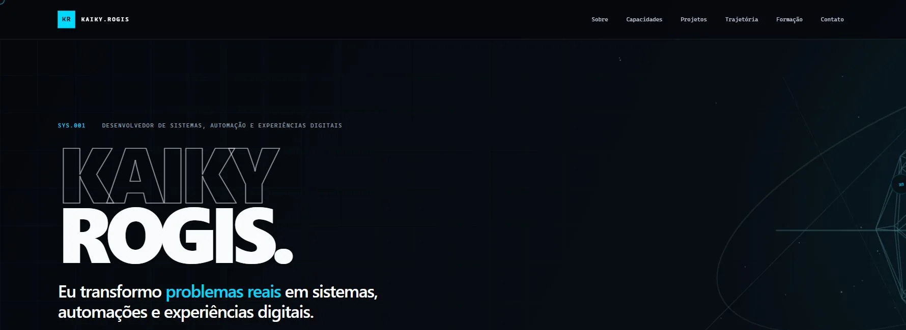

# Kaiky Rogis — Digital Systems

Portfólio profissional de Kaiky Rogis, desenvolvido para apresentar experiências reais em sistemas, automação, suporte técnico, banco de dados e produtos digitais.



## Site

[kaikyrogis.github.io](https://kaikyrogis.github.io) · [English version](https://kaikyrogis.github.io/en/)

## Destaques

- apresentação cinematográfica com versão de movimento reduzido;
- terminal interativo e central de navegação com `Ctrl + K`;
- estudos de caso de SintegraPro, OminiSafety, Finance OS e OmniChat, com
  capturas reais das interfaces e status apresentados de forma transparente;
- trajetória profissional, formação e mapa de competências;
- currículo atualizado para download com o nome original do arquivo;
- layout responsivo e navegação por teclado;
- publicação automática no GitHub Pages.
- versão integral em inglês na rota `/en/`, com metadados próprios;
- monitoramento diário de build, links internos e disponibilidade pública.

## Arquitetura

```text
app/
├── components/   # interface, diálogos, contato e cursor isolado
├── data/         # conteúdo estruturado do portfólio
├── hooks/        # comportamento acessível compartilhado
├── layout.tsx    # SEO, metadados e dados estruturados
└── page.tsx      # composição das seções e experiência
```

O site usa exportação estática do Next.js para o GitHub Pages. A integração mínima com Vinext/Cloudflare é mantida exclusivamente para a cópia privada de revisão; não há banco de dados, migrações ou infraestrutura D1 no portfólio.

## Desenvolvimento

Requer Node.js 22 ou superior.

```bash
npm install
npm run dev
```

## Qualidade

```bash
npm run typecheck
npm run lint
npm run format:check
npm run build
npm run check:links
npm run monitor
```

O build estático é gerado em `out/`. A versão 2.1 inclui navegação por teclado, redução real de movimento, busca funcional em `Ctrl + K`, imagens WebP e controles completos no mobile.

## Licença e conteúdo

O código-fonte é disponibilizado sob a [licença MIT](./LICENSE). Textos autorais, currículo, retrato e demais imagens pessoais permanecem protegidos conforme a [licença de conteúdo](./CONTENT-LICENSE.md).
